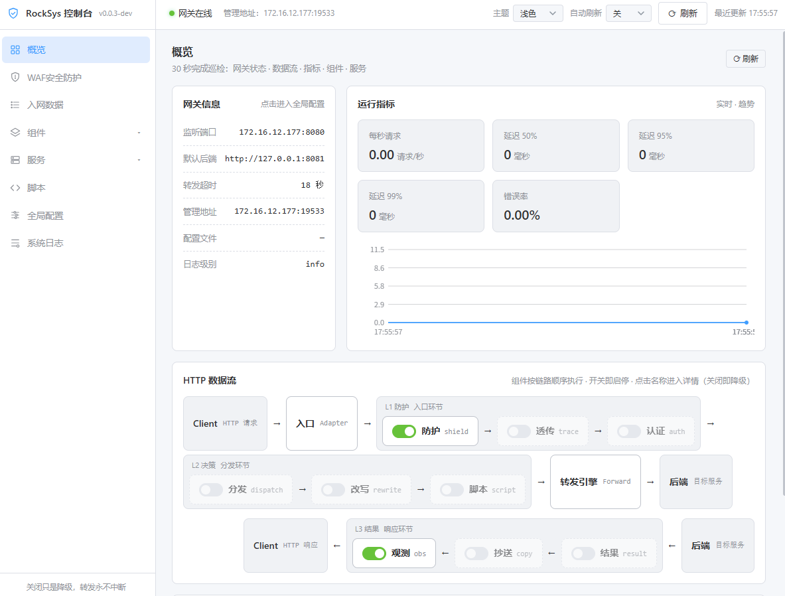

# RockSys 磐石安全网关

**极简增强式反向代理底座**：默认一台 HTTP 反向代理（等同极简 NGINX `proxy_pass`），能力按需挂载、全部可热开关。任何组件掉链子，紧急关闭，转发依旧。

> 核心哲学：**只有转发是必须的**。其余一切皆是可选增强，默认全关，可随时热插拔。

---

## 管理控制台（WebUI）

> 纯静态单页，随二进制分发，无需单独安装。产品设计见 `docs/webui.md`，对接契约见 `docs/webui-api.md`。



## 快速开始

**环境要求**：Go 1.25+（Linux / macOS / Windows 均可）。构建产物为**单个可执行文件**，WebUI 管理控制台已 `go:embed` 内嵌，零额外前端文件。

```bash
# 编译（版本号取当前 git 最新 tag；地基库缺失时自动同步）
make build

# 或直接构建（跳过 make deps，--version 显示 dev）
# go build -o bin/rocksys ./cmd/rocksys

# 运行（★ 必须在 bin/ 目录运行，工作目录 = bin/）
cd bin && ./rocksys --listen :8080 --upstream http://127.0.0.1:9000 --admin 127.0.0.1:19527
```

运行 RockSys 会同时出现 **3 个地址**，各自职责：

| 地址 | 默认值 | 是谁 | 谁访问 |
|------|--------|------|--------|
| 代理监听端口 | `:8080` | 对外收请求的入口 | 客户端/浏览器 |
| 被代理后端 | `http://127.0.0.1:9000` | 真正干活的业务服务（占位默认，需改为实际后端） | 只有代理转发给它 |
| 管理/WebUI | `127.0.0.1:19527` | 管理接口 + 图形控制台 | 运维（回环，不对外） |

浏览器打开 `http://127.0.0.1:19527/` 进入管理控制台（回环地址本机免登录，默认落地「概览」页）。

### 开发模式：改前端免编译（-tags dev）

WebUI 默认内嵌进二进制，改前端需重新编译；`-tags dev` 编译后改为实时读 `webui/` 源码目录，改 `index.html` / `assets/` 下文件**刷新浏览器即见**（新增文件需重启一次）：

```bash
go build -tags dev -o bin/rocksys ./cmd/rocksys
cd bin && ./rocksys
```

### 发布打包

- `make release`：编译二进制 + 拷贝外挂资源（SQL / WAF 规则 / 可信代理）到 `bin/hotscripts/`，运行期外挂优先、内嵌兜底，改文件无需重新编译；
- `make cross-build`：交叉编译 linux amd64/arm64、windows amd64，产物见 `bin/`。

> **Makefile 仅支持 Linux**（纯 Unix 语法）；Windows 原生 cmd 不支持，请经 WSL2 或直接用上方 `go build` 命令。

---

## 配置

配置来源（优先级从高到低）：**命令行参数 > 环境变量 > 工作目录 `.env` 配置文件**（开发规范下即 `bin/.env`），配置文件热更；运行时热改一律立即生效并写回配置文件（「热更即持久化」）。

全部配置项、可信代理模型、`bin/.env` 完整示例与管理接口令牌见 **[docs/CONFIGURATION.md](docs/CONFIGURATION.md)**。

---

## 常用运维命令

### rockctl（命令行工具）

`rockctl` 是独立的运维 CLI（与 `rocksys` 是两个二进制）：

```bash
# 构建 rockctl
go build -o bin/rockctl ./cmd/rockctl

# 默认连 127.0.0.1:19527；远程可 --admin 指定；令牌经环境变量 ROCKSYS_ADMIN_TOKEN（仅管理接口绑定非回环地址时使用）
rockctl switch list                # 列出组件状态
rockctl switch on shield           # 开启防护
rockctl switch off dispatch        # 关闭路由（回退默认后端）
rockctl config get                 # 查看当前配置
rockctl config set ROCKSYS_UPSTREAM http://127.0.0.1:9001   # 热改配置
rockctl script publish rule.lua    # 发布 Lua 策略
rockctl script rollback            # 回滚脚本
```

### 直接调用管理 API

```bash
curl http://127.0.0.1:19527/admin/switch/list
curl -X PUT http://127.0.0.1:19527/admin/config -d '{"ROCKSYS_UPSTREAM":"http://127.0.0.1:9001"}'
curl "http://127.0.0.1:19527/admin/logs?from=2026-08-04&to=2026-08-04"
```

---

## 生产部署

目录规划、systemd 服务、Nginx 反代（HTTPS 终结）、安全建议、升级与优雅重启、多副本、日志与留存见 **[docs/DEPLOYMENT.md](docs/DEPLOYMENT.md)**。

---

## 故障与降级

| 症状 | 处理 |
|------|------|
| 后端全挂 | dispatch 摘除节点并写 503；关闭 dispatch 即回退默认后端 |
| 防护误拦 | 关闭 shield 或调整规则 |
| Lua 脚本出错 | 自动回滚或 `script rollback` 移除 |
| 配置改坏 | 恢复默认值，或改回 `bin/.env` 后 3s 热更 |
| 组件故障 | 关闭即摘除，转发链自动降级，**转发永不中断** |

---

## 使用注意事项

- **WAF / 限流 / 路由等全部默认关闭**：需要防护与分发时显式开启对应挂件；关闭即降级为裸代理，转发不中断。
- **WebSocket 支持、大文件不中转**：Upgrade 握手（101）后双向字节隧道原样透传（握手前仍走完整中间件链）；大文件上传/下载不中转，避免二进制流占用代理。
- **管理接口仅监听回环地址**（默认 `127.0.0.1:19527`），勿对外网暴露。
- **WAF 规则 / SQL 脚本均支持外置目录热更**（`hotscripts/rules/`、`hotscripts/sql/`，外挂优先、内嵌兜底），改文件无需重新编译。
- **数据库零配置**：默认 SQLite 本地文件 `rocksys.db`，可经 `DB_DRIVER` / `DB_DSN` 切换 MySQL / PostgreSQL。

---

## 文档

| 文档 | 面向 | 内容 |
|------|------|------|
| [README.md](README.md) | 终端用户 | 本页：功能、构建、部署、使用 |
| [docs/CONFIGURATION.md](docs/CONFIGURATION.md) | 运维/开发者 | 全部配置项、可信代理模型、`bin/.env` 完整示例与管理接口令牌 |
| [docs/DEPLOYMENT.md](docs/DEPLOYMENT.md) | 运维 | 生产部署：目录规划、systemd、Nginx 反代、安全建议、升级与多副本 |
| [docs/HTTP_DATAFLOW.md](docs/HTTP_DATAFLOW.md) | 开发者/终端用户 | 网络数据流转过程解析 |
| [docs/COMPONENTS.md](docs/COMPONENTS.md) | 开发者 | 各组件/子组件作用与使用方法、配置项详解 |
| [docs/DATA_DICT.md](docs/DATA_DICT.md) | 开发者 | 数据字典：业务表字段/枚举定义（数据层唯一权威视图） |
| [docs/webui.md](docs/webui.md) | 产品 | 管理控制台产品设计（页面/交互/视觉规范） |
| [docs/webui-api.md](docs/webui-api.md) | 前端 | 管理接口契约（WebUI 对接唯一权威，无需读源码） |
| [docs/PROJECT_STRUCTURE.md](docs/PROJECT_STRUCTURE.md) | 开发者 | 目录结构、模块关系、热运维引擎 |
| [docs/DEV_HANDBOOK.md](docs/DEV_HANDBOOK.md) | AI Agent | 详细技术规格，供对照实现 |

---
