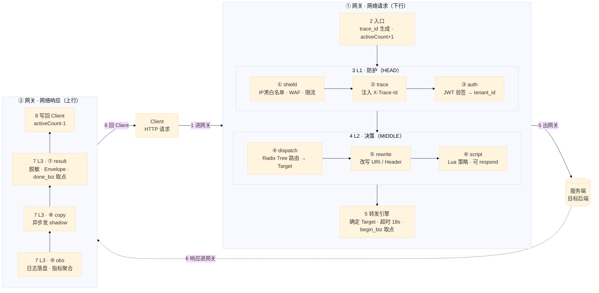
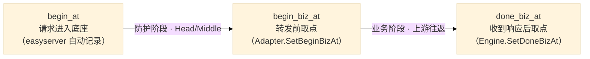

# RockSys HTTP 数据流说明

> 依据：`internal/chain/`（链机制）、`internal/engine/engine.go`（转发）、`internal/dataflow/`（数据载体）、`plugins/*`（各挂件）。

> 依赖方向：挂件仅依赖底座接口（`chain.Middleware` / `chain.ResponseHook` / `hotswap.MiddlewareLifecycle`），**底座不依赖任何挂件**（ARCHITECTURE.md §8 红线）。

---

## 一、数据流架构图

> **名词速查**
> - **DataFlow**：请求级数据载体（"车厢"），贯穿整条转发链，中间件通过它读写共享字段（`internal/dataflow/`）。
> - **trace_id**：全链路唯一请求 ID（32 位 hex），入口生成，透传上游并回写响应头 `X-Trace-Id`。
> - **三时间戳**：`begin_at`（请求进入底座）→ `begin_biz_at`（转发前取点）→ `done_biz_at`（收到响应后取点），用于耗时分解（见 2.4）。
> - **tenant_id**：租户标识，auth 验签 JWT 后写入，obs 按此维度统计。
> - **Target**：转发目标，dispatch 按路由规则选出的目标后端节点（URL / 权重 / 健康状态）；未命中路由时回退默认 upstream。
> - **upstream**：默认上游地址（`--upstream` 启动参数），未命中任何路由规则时的兜底转发目标。
> - **shadow**：影子后端，copy 组件把线上请求异步复制一份发往此处，用于流量审计 / 影子验证。
> - **Envelope**：统一响应封装格式（result 可选开启），非 JSON 响应原样透传。
> - **L1 / L2 / L3**：三层槽位语义——L1 防护（Head）、L2 决策（Middle）、L3 结果（Tail）。

---

## 二、数据流过程解析

> 本部分为前述各图节点（编号 ①–⑨）的行为明细，重点说明：**传递链如何被影响**（放行/中断/逆序）与**数据本身如何被影响**（DataFlow / 请求 / 响应各字段）。

### 2.1 入口与链机制

| 节点 | 行为 |
|---|---|
| **入口 Adapter.Handler** | `easyserver` 收包后进入的唯一入口；activeCount+1；把 httpsvr.DataFlow 包装为 rocksys DataFlow；**trace_id**：优先读 `X-Trace-Id` 请求头，无则生成 32 位 hex（幂等，全链路唯一） |
| **Chain.Execute（转发前链）** | 按 **Head → Middle** 顺序逐个调用 `Handle`；任一返回 `false` 即中断（该中间件已写响应），不再转发 |
| **响应阶段 ResponseHooks** | 仅对 **Tail** 槽位：取注册顺序的**逆序**执行 `OnResponse`（即 result → copy → obs）；实现 `ResponseHook` 的中间件才有此回调 |
| **响应缓冲** | 存在 Tail 响应中间件时，上游响应先写入 `respBufferWriter`（**≤4MB**，超出直写客户端并截断标记），供 Tail 读取/改写；无则流式直写 |

### 2.2 各挂件对「链」与「数据」的时序影响

| 编号 | 组件 | 槽位 | 链上时序行为 | 对传递链的影响 | 对数据的影响 |
|---|---|---|---|---|---|
| ① | **shield**（L1 防护） | Head | 顺序执行：IP 黑白名单 → WAF 检测 → 路径/UA 规则 → 令牌桶限流 | 黑名单/规则/WAF 命中或限流超限 → 写 **403/429** 并中断链 | 只读请求（IP/Path/UA/Body 长度） |
| ② | **trace**（透传） | Head | 读取 DataFlow.TraceID 写入响应头 `X-Trace-Id` | 放行 | **写响应头**（在 WriteHeader 前设置） |
| ③ | **auth**（JWT 认证） | Head | 校验 `Authorization: Bearer <token>` → 验签（HS256/issuer/过期） | 无 token 或验签失败 → 写 **401** 并中断链 | 通过时 **写入 DataFlow.TenantID** |
| ④ | **dispatch**（L2 路由） | Middle | Radix Tree 前缀匹配（支持 `:param`/`*`）→ 节点组选择（平滑加权轮询/一致性哈希 + 主动健康检查） | 未命中 → 不写 Target（回退默认 upstream）；命中但无健康节点 → 写 **503** 并中断链 | **写入 DataFlow.Target**；`:param` 捕获写入 DataFlow 并注入请求头 `X-Route-Param-*` |
| ⑤ | **rewrite**（改写） | Middle | 前缀命中 → 改写 URI 前缀 + 注入请求头 | 放行 | **改写请求**（`URL.Path`、Header） |
| ⑥ | **script**（Lua 策略） | Middle | 逐脚本执行（沙箱 VM 池，超时 100ms）；API 可读请求、写 Target、respond | 脚本 `respond` → 写响应并中断链 | 可**改写 Target / 请求 / 响应**（限网关策略，禁止业务语义） |
| ⑦ | **result**（L3 结果） | Tail（ResponseHook，逆序第一） | JSON 响应 → 可选脱敏（掩码规则）→ 可选 Envelope 封装 → `WriteFinal` 写回 | 改写响应后置 done，后续 hook 与 Adapter 不再写回 | **改写响应体/头**；非 JSON 原样透传 |
| ⑧ | **copy**（抄送） | Tail（ResponseHook，逆序第二） | 从请求快照复制 method/URL/Header，异步发送至全部 shadow 后端 | 放行（发送失败仅告警） | 不阻塞主链；**不复制 body**（转发时已被上游消费） |
| ⑨ | **obs**（观测） | Tail（ResponseHook，逆序最后） | 构造 AccessRecord（含三时间戳/租户/状态码/耗时）→ 异步落盘（file/db）+ 1 分钟滑动窗口指标聚合 | 放行（只读） | 不修改数据；记录 `ShieldMs/BizMs/TotalMs` 等 |

### 2.3 数据载体 DataFlow 字段

| 字段 | 写入者 | 用途 |
|---|---|---|
| `trace_id` | 入口自动生成 / auth 前已有 | 全链路唯一标识，透传上游与响应头 |
| `begin_at` | easyserver 自动记录 | 请求进入底座的时刻 |
| `begin_biz_at` | Adapter（转发前取点，`SetBeginBizAt`） | 业务开始时刻 |
| `done_biz_at` | Engine.Forward（收到响应/失败后取点，`SetDoneBizAt`） | 业务结束时刻 |
| `tenant_id` | auth | 租户识别，obs 记录维度 |
| `target` | dispatch | 转发目标；未写入则由 Adapter 回退默认 upstream |
| 通用 KV | 任意中间件（`Set/Get`） | 中间结果传递（如 `rocksys:path_params`） |

### 2.4 三时间戳与耗时分解

- 防护耗时 = `begin_biz_at − begin_at`（Head/Middle 阶段）
- 业务耗时 = `done_biz_at − begin_biz_at`（上游往返）
- 总耗时 = `done_biz_at − begin_at`
- 精度要求：同进程内单调时钟相减，禁止跨进程绝对时间戳相减。

### 2.5 转发引擎与降级语义

| 项 | 说明 |
|---|---|
| 转发保留 | method / header / body 原样保留；Host 改写为目标节点；追加 `X-Forwarded-For`、`X-Trace-Id` |
| 超时 | 默认 **18s**（可配置），超时 → 504；连接失败 → 502 |
| WebSocket | Upgrade 请求走独立分支：直连后端 TCP，握手后**双向字节对拷**（不解析 ws 帧） |
| 响应回写 | 无 Tail 改写时直接流式拷贝响应头/状态码/体 |
| 降级链 | 关闭任一挂件 → 请求直通下一环；全部关闭 = 裸反向代理（默认 upstream 直转，转发永不中断） |
